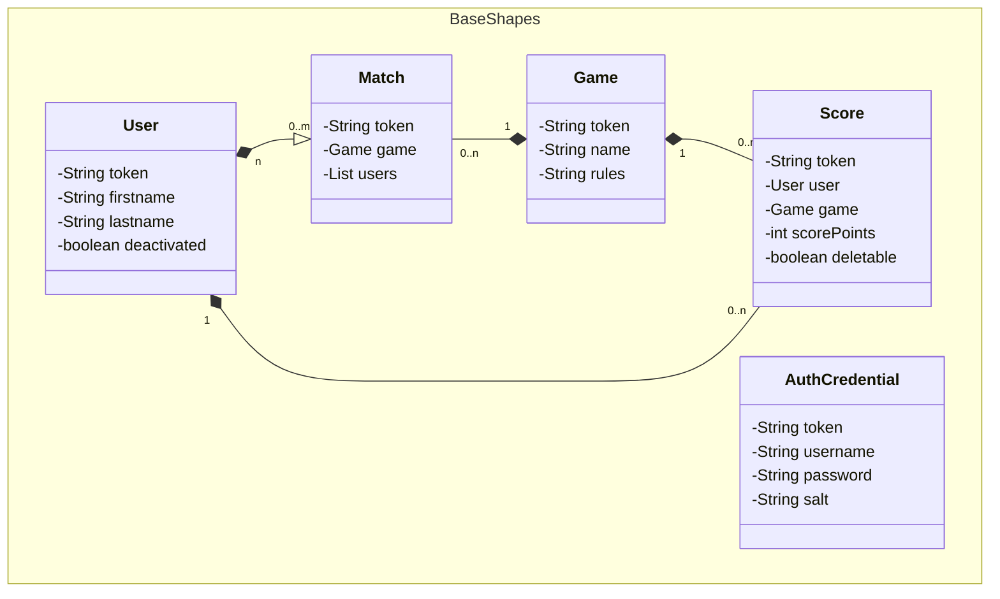

# gepardec-gamertrack

This is a learning project for Juniors. An app for tracking results of various sports competitions.


## Getting Started – Quarkus Application

The Quarkus implementation of the application is available on the following branch `feature/OpenRewriteUsingRecipes`


## Required Environment Variables for Backend
The application requires several environment variables. The values for the demo-deployment can be found in the shared folder named `Gamertrack` in Keeper.
For a local deployment create a `.env` file in the project root with these example values

```
# Admin user and password for login
SECRET_ADMIN_NAME=admin
SECRET_DEFAULT_PW=admin@gamertrack
# Seed for hashing must be at least 64 chars long,
# generate your own, e.g. with: openssl rand -hex 48
SECRET_JWT_HASH=<generated-hex-string-of-at-least-64-chars>
# CORS properties
ALLOWED_ORIGINS_AS_REGEX=^(http|https)://localhost
```

The `.env` file in the project root is picked up automatically:
* **Packaged app** (`java -jar ...`): Quarkus reads `.env` from the directory you start the app from (e.g. the project root).
* **Dev mode** (`mvn quarkus:dev`) and the **integration tests**: the Maven plugins are configured to run with the project root as working directory, so the root `.env` is found without further setup.

Alternatively, export the variables as regular environment variables in your shell — they always take precedence over the `.env` file.

## Building and Starting the Application

### Backend (Quarkus)
```console
mvn clean install  
mvn quarkus:dev -pl gamertrack-war
```

### Integration Tests
The integration tests are `@QuarkusTest`s: they start the application themselves,
no running server is required. Harmless test values are provided in
`gamertrack-IntegrationTest/src/test/resources/application.properties`; the
`SECRET_JWT_HASH` is read from the root `.env` file or the environment variable
of the same name. All values can be overridden via environment variables.

```console
mvn clean install
mvn verify -Prun-integrationtests
```

### Frontend
The frontend is located at the following path `https://github.com/Gepardec/gepardec-gamertrack-frontend`

Please check out the `main` branch 

Then run the following commands to start the frontend:

```console
npm install  
npm start
```
Then connect to http://localhost:4200/ and
   * Login with admin user and password
   * Create at least two users
   * Create a game (e.g. Darts)
   * Create the results for a match by selecting a game, winner and looser


## Old Widlfly Requirements

The following technologies are used by Gepardec-Gamertrack

1. `Java 23.x.x`
2. `WildFly 34.0.0.Final`
3. `Maven 3.4.x`
4. `H2-Database`
5. `Mockito`

## application.properties

The application needs the following variable set:

> ALLOWED_ORIGINS_AS_REGEX=^(http|https)://gamertrack-frontend.apps.cloudscale-lpg-2.appuio.cloud

## secret.env

The application needs a secret.env file located in the project root with the following variables set in order for 
authentication and tests to work. 

```
SECRET_ADMIN_NAME=
SECRET_JWT_HASH=
SECRET_DEFAULT_PW=
```
`SECRET_JWT_HASH` must be at least 64 chars long.

For convenience the [plugin](https://plugins.jetbrains.com/plugin/7861-envfile) is recommended for reading the secret.env when tests are executed via IntelliJ 

## Build Project and deploy application
**You can either use the built-in tools for Maven & WildFly in IntelliJ or use the following commands:**
- *In order for all used relative paths to work they should be executed from the projects root directory*

**Build**
*(This will also download the correct WildFly version into the project root)*
```zsh 
  mvn clean install -am
```

**Start wildfly**

```zsh
  wildfly/bin/standalone.sh
```

**Deploy application to wildfly**

```zsh
  wildfly/bin/jboss-cli.sh --connect --command="deploy --force ./gamertrack-war/target/gepardec-gamertrack.war"
```

**Undeploy and stop wildfly**

```zsh
  $WILDFLY_HOME/bin/jboss-cli.sh --connect --command="undeploy gepardec-gamertrack.war"
```

**Stop wildfly**

```zsh
  $WILDFLY_HOME/bin/jboss-cli.sh --connect --command="shutdown"
```


## ER-diagram



## HTTPS-ENDPOINTS

Rest-Endpoints are available via

```http
 localhost:8080/gamertrack-war-1.0-SNAPSHOT/api/v1/
```

###

| Endpoint    | Description       |
|:------------|:------------------|
| `/auth`     | login & validate  |
| `/health`   | App Health Status |
| `/users`    | CRUD - operations |
| `/games`    | CRUD - operations |
| `/matches`  | CRUD - operations |
| `/scores`   | CRU - operations  |
| `/ranklist` | Top Scores        |


For more specific information for each endpoint
visit: [OpenApi Spec](https://petstore.swagger.io/?url=https://raw.githubusercontent.com/Gepardec/gepardec-gamertrack/refs/heads/main/docs/openapi-spec.yaml)
